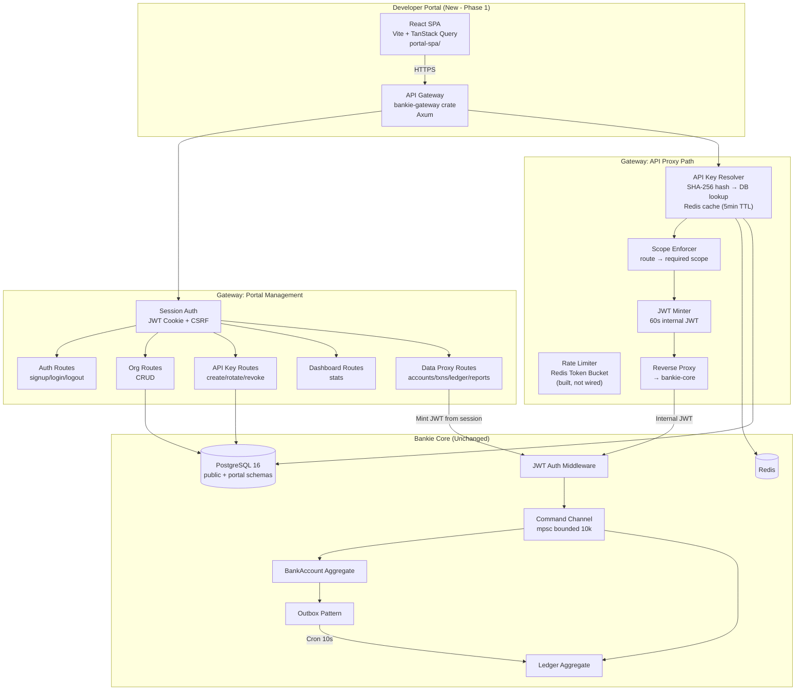
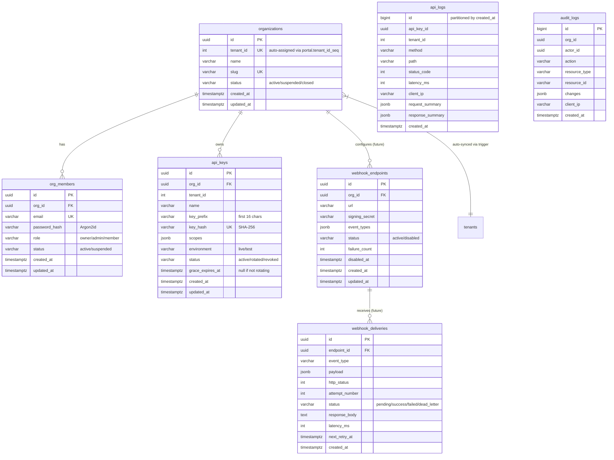

# PRD: Bankie Developer Portal (v1.1 — Post-Implementation Refinement)

| Field | Value |
|-------|-------|
| **Owner Pillar** | Fiat / Onboarding |
| **Feature Label** | Developer Portal |
| **Authors** | PM Agent (bankie team) |
| **Audiences** | Engineering, Product, Security, Compliance |
| **Status** | Implemented (Phase 1 Complete, Phase 1.1 In Progress) |
| **Version** | 1.2 |
| **Reviewers** | sam.wang (SVP Eng), chad.liu, sims.xu, ivan.kp.lau |
| **Domain Owners** | Fiat Tech: sims.xu, donald.ding, auli.chan · Onboarding Tech: chad.liu, ivan.kp.lau |
| **PRD Date** | 2026-02-26 |
| **Implementation PR** | #8 (feature/dev-portal merged) |

---

## 1. TL;DR / Executive Summary

Bankie is a production-grade banking/ledger system with CQRS/Event Sourcing, multi-tenant JWT auth, double-entry bookkeeping, sub-accounts, and multi-asset support. Previously, tenant onboarding required manual JWT generation via CLI, there was no self-service key management, no webhook system, and no visibility into API usage.

**The Bankie Developer Portal** introduces a self-service React SPA + API Gateway layer that enables tenants to manage organizations, API keys, and view banking data — without touching Bankie Core internals. The gateway proxies API requests to Core using short-lived internal JWTs, with scope-based access control.

**Phase 1 outcomes (delivered)**: Self-service org signup, API key lifecycle (create/rotate/revoke), scope-enforced API access, data proxy to Core (accounts, transactions, ledger, reports), session-based portal auth with CSRF protection, and full Docker Compose deployment.

**Phase 1.1 (in progress)**: Dashboard scopes-granted metric, API request logging to `portal.api_logs`, audit logging for key operations + recent activity feed.

**Remaining for future phases**: Webhook delivery, rate limiting on proxy path, sandbox environment, team member invite flow.

---

## 2. Problem Statement

### Current Pain Points

| # | Problem | Impact | Severity | Status |
|---|---------|--------|----------|--------|
| P1 | Tenant onboarding requires CLI `cargo run --bin bankie -- --mode jwt` per tenant | Manual, error-prone, doesn't scale beyond 10 tenants | **Critical** | **Resolved** |
| P2 | No API key rotation — compromised JWT requires full reissuance + downtime | Security risk; no grace period for migration | **Critical** | **Resolved** |
| P3 | No webhook system — tenants must poll for state changes | Inefficient integration, missed events, delayed reconciliation | **High** | Open (tables created, dispatcher not built) |
| P4 | No API usage visibility — no request logs, no rate limiting metrics | Cannot diagnose issues, no abuse protection | **High** | 🔜 Phase 1.1: API request logging + dashboard metrics. Phase 2: rate limiter wiring. |
| P5 | No team management — single JWT per tenant, no role separation | Shared credentials, no audit trail of who did what | **Medium** | Partially addressed (owner/admin/member roles, no invite flow yet) |
| P6 | No sandbox environment — tenants test against production data | Risk of data corruption, compliance concern | **Medium** | Open |

### Goals

1. **Self-service tenant onboarding** — org signup → API key generation in < 5 minutes ✅
2. **Secure key lifecycle** — create, rotate (with 24h grace period), revoke, scope permissions ✅
3. **Webhook-driven architecture** — push events to tenant endpoints with reliability guarantees ❌ (Future)
4. **API observability** — searchable request logs, rate limiting with standard headers 🔜 (Phase 1.1: request logging + dashboard metrics; Phase 2: rate limiting)
5. **Team collaboration** — RBAC with Owner/Admin/Member roles ⚠️ (Auth done, invite flow pending)
6. **Environment isolation** — sandbox vs production ❌ (Future)

### Non-Goals (Explicitly Out of Scope)

- Replacing the CQRS/Event Sourcing core architecture
- Building a mobile app for the portal
- Multi-region deployment (v1 is single-region)
- Custom branding / white-label portal per tenant
- Billing / usage-based pricing (future phase)
- GraphQL API (REST only in v1)
- OAuth2 / OIDC for portal login (email/password is sufficient for B2B v1)

---

## 3. User Personas

### Persona 1: Integration Developer ("Dev Dana")
- **Role**: Backend engineer at a fintech integrating with Bankie
- **Needs**: Quick API key setup, clear docs, sandbox to test, webhook for async events
- **Addressed**: Self-service signup, scoped API keys, API docs page in SPA
- **Remaining**: Sandbox environment, webhook subscriptions

### Persona 2: Technical Lead ("Lead Leo")
- **Role**: Tech lead managing team of developers at the integrating company
- **Needs**: Team member management, key rotation without downtime, audit logs
- **Addressed**: Key rotation with 24h grace period, owner/admin/member RBAC
- **Remaining**: Member invite flow, audit log viewer

### Persona 3: Operations Manager ("Ops Olivia")
- **Role**: Ops person monitoring transaction flow and reconciliation
- **Needs**: Dashboard overview, transaction monitoring, webhook delivery status
- **Addressed**: Dashboard with stats, Accounts/Transactions/Reports pages proxying Core data
- **Remaining**: Webhook delivery status, API request log viewer

---

## 4. Architecture Overview (As Built)



### Cargo Workspace Structure (As Built)

```
bankie/
├── Cargo.toml                  # Workspace root
├── crates/
│   ├── bankie-core/            # Original banking server (unchanged)
│   ├── bankie-common/          # Shared types (AppError, Money, etc.)
│   └── bankie-gateway/         # NEW: Portal gateway service
│       ├── src/
│       │   ├── main.rs         # Gateway server entry point
│       │   ├── lib.rs
│       │   ├── config.rs       # Gateway config (core_url, jwt_secret, etc.)
│       │   ├── state.rs        # PortalState (repos + jwt_secret)
│       │   ├── proxy.rs        # Reverse proxy to bankie-core
│       │   ├── redis_ops.rs    # Redis get/set/rate_limit_check
│       │   ├── middleware/
│       │   │   ├── api_key_resolver.rs  # Bearer → hash → DB/Redis lookup
│       │   │   ├── scope_enforcer.rs    # Route → required scope check
│       │   │   ├── rate_limiter.rs      # Token bucket (built, not wired)
│       │   │   ├── jwt_minter.rs        # Mint 60s internal JWT
│       │   │   └── session.rs           # Cookie JWT + CSRF validation
│       │   ├── routes/
│       │   │   ├── auth.rs      # signup/login/logout
│       │   │   ├── org.rs       # Org CRUD
│       │   │   ├── api_key.rs   # Key create/list/rotate/revoke
│       │   │   ├── dashboard.rs # Stats endpoint
│       │   │   └── data_proxy.rs# Proxy GETs to bankie-core
│       │   ├── models/          # Domain models (ApiKey, OrgMember, etc.)
│       │   └── repo/            # Repository traits + PostgreSQL impls + mocks
├── portal-spa/                  # React SPA (Vite + TypeScript)
│   ├── src/
│   │   ├── App.tsx
│   │   ├── pages/              # Dashboard, ApiKeys, Organization, Accounts,
│   │   │                       # Transactions, Reports, ApiDocs, Login, Signup
│   │   ├── components/         # Layout, Sidebar, ProtectedRoute, etc.
│   │   ├── hooks/useAuth.ts    # Auth context + session management
│   │   ├── api/client.ts       # API client with cookie auth
│   │   └── types/index.ts      # TypeScript interfaces
└── db/migrations/
    ├── 20260226000001_portal_schema.sql      # portal.* tables
    └── 20260226000002_portal_tenant_sync.sql  # org → tenant auto-sync trigger
```

### Key Architectural Decisions (Confirmed)

| Decision | Rationale | Status |
|----------|-----------|--------|
| **Gateway as separate Axum crate in workspace** | Decouples portal concerns from core; shared types via bankie-common. Core remains unchanged. | ✅ Built |
| **API Key → Internal JWT bridge** | Tenants use API keys externally. Gateway resolves key → tenant, mints short-lived 60s JWT, forwards to Core. Zero Core auth changes. | ✅ Built |
| **Session auth for portal UI** | Email/password → Argon2 hash → session JWT in httpOnly cookie + CSRF token. 24h session TTL. | ✅ Built |
| **Redis for API key cache** | 5-minute TTL. Fails open on Redis errors (same pattern as existing idempotency). | ✅ Built |
| **Shared PostgreSQL, separate schemas** | Portal tables in `portal` schema. Core tables stay in `public`. DB trigger auto-syncs org → tenant. | ✅ Built |
| **Dual API key routes** | Org-scoped (`/orgs/:id/keys`) + flat (`/api-keys`) for SPA convenience. Both delegate to same logic. | ✅ Built |
| **Data proxy via session** | Portal SPA uses session-based data proxy routes (not API keys) to read Core data. Mints short-lived JWT from session claims. | ✅ Built |

---

## 5. Functional Requirements (MoSCoW — Updated)

### MUST Have (P0 — MVP) — Implementation Status

| ID | Requirement | Status | Notes |
|----|------------|--------|-------|
| M1 | **API Key CRUD** | ✅ Done | Keys prefixed `bk_live_`; SHA-256 hash stored; raw key shown once; `key_hash` excluded from JSON serialization |
| M2 | **Key Rotation with Grace Period** | ✅ Done | 24h default grace period; old key status → `rotated`; new key inherits scopes |
| M3 | **Scoped Permissions** | ✅ Done | 8 scopes: `accounts:read/write`, `ledgers:read/write`, `transactions:read`, `reports:read`, `house_accounts:read/write`. Validated at creation + enforced per-route. |
| M4 | **API Key → Tenant Resolution** | ✅ Done | Lookup by SHA-256 hash; Redis cache (5min TTL); fails open on Redis error |
| M5 | **Rate Limiting** | ⚠️ Partial | Token bucket middleware built (100 burst, 1000/min). Headers: `X-RateLimit-Limit/Remaining/Reset`. **Not yet wired to proxy path.** |
| M6 | **Organization Management** | ✅ Done | Create org, auto-assign tenant_id via DB sequence, slug uniqueness, DB trigger syncs to tenants table |
| M7 | **Team RBAC** | ⚠️ Partial | 3 roles: Owner/Admin/Member. Session-based auth. **No invite flow yet** — members created only via signup. |
| M8 | **Dashboard — Home/Overview** | ⚠️ Phase 1.1 | Org name, environment, total/active key counts delivered. **Scopes granted was incorrectly showing total_api_keys count** (needs unique scope computation). **API request count was hardcoded to 0** (needs api_logs integration). **Recent activity was static placeholder** (needs audit_logs integration). |
| M9 | **Dashboard — API Keys page** | ✅ Done | List, create, rotate, revoke. Eye-toggle to reveal key prefix. Copy-to-clipboard for new keys. |
| M10 | **Sandbox Environment** | ❌ Not Started | `Environment` enum exists (`Live`/`Test`); no routing logic yet |

### SHOULD Have (P1 — Post-MVP)

| ID | Requirement | Status | Notes |
|----|------------|--------|-------|
| S1 | **Webhook Management** | ❌ Tables Only | `webhook_endpoints` + `webhook_deliveries` tables created. No API routes or dispatcher. |
| S2 | **Webhook Retry with Backoff** | ❌ Not Started | — |
| S3 | **Webhook Delivery Logs** | ❌ Not Started | — |
| S4 | **API Request Logging** | 🔜 Phase 1.1 | `api_logs` partitioned table created (Feb-Apr 2026). **Phase 1.1**: Gateway middleware to log all API proxy requests (method, path, status, latency) to partitioned table. Dashboard 24h call count reads from this table. |
| S5 | **Dashboard — Webhook page** | ❌ Not Started | — |
| S6 | **Dashboard — Logs page** | ❌ Not Started | — |
| S7 | **Dashboard — Accounts page** | ✅ Done | Proxies Core `/v1/accounts` + `/v1/bank_account/:id` via data proxy |
| S8 | **Dashboard — Transactions page** | ✅ Done | Proxies Core `/v1/transaction` with full filter support |
| S9 | **Dashboard — Reports page** | ✅ Done | Proxies Core settlement report CSV |
| S10 | **Dashboard — API Docs page** | ✅ Done | Static API reference page in SPA |

### COULD Have (P2 — Future)

| ID | Requirement | Status |
|----|------------|--------|
| C1 | **Audit Log** | 🔜 Phase 1.1 — write logic for key ops (create/rotate/revoke), org updates, login events; dashboard recent activity feed |
| C2 | **Dashboard — Settings page** | Not started |
| C3 | **IP Allowlisting** | Not started |
| C4 | **Usage Analytics** | Not started |
| C5 | **Email Notifications** | Not started |
| C6 | **API Versioning** | Not started |

### WON'T Have (v1)

| ID | Requirement | Rationale |
|----|------------|-----------|
| W1 | OAuth2 / OIDC for portal login | Email/password + session JWT sufficient for B2B |
| W2 | Custom branding per tenant | Engineering cost too high for v1 |
| W3 | GraphQL API | REST sufficient |
| W4 | Multi-region deployment | Single-region adequate for initial scale |
| W5 | Usage-based billing | No pricing model yet |

---

## 6. Non-Functional Requirements

| Category | Requirement | Target | Status |
|----------|------------|--------|--------|
| **Latency** | API key resolution (cache hit) | < 1ms p99 | ✅ Redis GET |
| **Latency** | API key resolution (cache miss) | < 10ms p99 | ✅ PG indexed lookup |
| **Latency** | Rate limit check | < 1ms p99 | ⚠️ Built, not wired |
| **Latency** | Internal JWT minting | < 1ms p99 | ✅ In-process |
| **Security** | API key storage | SHA-256 hashed; `#[serde(skip_serializing)]` on `key_hash` | ✅ |
| **Security** | Password storage | Argon2id with random salt | ✅ |
| **Security** | Portal session | httpOnly cookie, SameSite=Lax, CSRF token in header | ✅ |
| **Security** | Internal JWT | 60s TTL, `iss: bankie-gateway`, `aud: service` | ✅ |
| **Security** | Password hash never serialized | `#[serde(skip_serializing)]` on `password_hash` | ✅ |
| **Scalability** | Tenants | 1,000+ orgs (auto-incrementing tenant_id via `portal.tenant_id_seq` starting at 100) | ✅ |
| **Scalability** | API keys per org | No hard limit in schema | ✅ |
| **Data retention** | API request logs | Partitioned by month (Feb-Apr 2026 created) | ✅ Schema |

---

## 7. Data Model (As Built)

### Portal Schema (`portal.*`)



### Tenant Auto-Sync Trigger

```sql
-- portal.sync_org_to_tenant() fires AFTER INSERT on portal.organizations
-- Inserts into public.tenants with full scope set:
--   accounts:read accounts:write ledgers:read ledgers:write
--   transactions:read reports:read house_accounts:read house_accounts:write
-- ON CONFLICT updates name + status
```

This eliminates manual tenant provisioning entirely.

---

## 8. API Design (As Built)

### 8.1 Portal Auth APIs (Public — No Session Required)

| Method | Path | Description | Implementation |
|--------|------|-------------|----------------|
| POST | `/portal/v1/auth/signup` | Create org + owner member, set session cookies | `routes/auth.rs` |
| POST | `/portal/v1/auth/login` | Email/password → session cookies | `routes/auth.rs` |
| POST | `/portal/v1/auth/logout` | Clear session + CSRF cookies (Max-Age=0) | `routes/auth.rs` |

**Auth Response** (signup + login):
```json
{
  "token": "<session_jwt>",
  "user": { "id": "uuid", "email": "...", "role": "owner", "created_at": "..." },
  "organization": { "id": "uuid", "name": "...", "slug": "...", "environment": "live", "created_at": "..." }
}
```
Cookies set: `portal_session=<jwt>; HttpOnly; SameSite=Lax; Max-Age=86400` + `csrf_token=<random32>; SameSite=Lax; Max-Age=86400`

### 8.2 Portal Management APIs (Session Auth Required)

#### Organizations

| Method | Path | Auth | Description |
|--------|------|------|-------------|
| POST | `/portal/v1/orgs` | Session | Create organization (tenant_id auto-assigned) |
| GET | `/portal/v1/orgs/:id` | Session | Get org details (org membership enforced) |
| PATCH | `/portal/v1/orgs/:id` | Session (owner/admin) | Update org name/status |

#### API Keys (Org-Scoped + Flat)

| Method | Path | Auth | Description |
|--------|------|------|-------------|
| POST | `/portal/v1/orgs/:org_id/keys` | Session | Create API key (raw key returned once) |
| GET | `/portal/v1/orgs/:org_id/keys` | Session | List keys (prefix only, no raw) |
| DELETE | `/portal/v1/orgs/:org_id/keys/:id` | Session | Revoke key immediately |
| POST | `/portal/v1/orgs/:org_id/keys/:id/rotate` | Session | Rotate key (24h grace period) |
| POST | `/portal/v1/api-keys` | Session | Flat: create (org from session) |
| GET | `/portal/v1/api-keys` | Session | Flat: list (org from session) |
| DELETE | `/portal/v1/api-keys/:id` | Session | Flat: revoke (org from session) |
| POST | `/portal/v1/api-keys/:id/rotate` | Session | Flat: rotate (org from session) |

#### Data Proxy (Session Auth → Core)

| Method | Path | Proxies To | Description |
|--------|------|-----------|-------------|
| GET | `/portal/v1/data/accounts` | `/v1/accounts` | List accounts (paginated) |
| GET | `/portal/v1/data/accounts/:id` | `/v1/bank_account/:id` | Get account detail |
| GET | `/portal/v1/data/accounts/:id/sub-accounts` | `/v1/bank_account/:id/sub-accounts` | Sub-account list |
| GET | `/portal/v1/data/accounts/:id/balance-history` | `/v1/bank_account/:id/balance-history` | Balance history |
| GET | `/portal/v1/data/transactions` | `/v1/transaction` | List transactions (filterable) |
| GET | `/portal/v1/data/ledger/:id` | `/v1/ledger/:id` | Get ledger view |
| GET | `/portal/v1/data/reports/settlement` | `/v1/report/settlement` | Settlement CSV |

Data proxy flow: Session claims → mint 60s JWT with `tenant_id` → forward GET to Core.

### 8.3 API Proxy Path (API Key Auth — For External Integrations)

```
Client → Authorization: Bearer bk_live_xxx
  → api_key_resolver (hash → DB/Redis lookup → ResolvedApiKey)
  → scope_enforcer (route → required scope → check key scopes)
  → [rate_limiter — built but not wired]
  → jwt_minter (ResolvedApiKey → 60s internal JWT)
  → proxy_handler → bankie-core
```

### 8.4 API Key Scopes (As Implemented)

| Scope | Routes Protected |
|-------|-----------------|
| `accounts:read` | GET `/v1/bank_account/*`, `/v1/accounts`, `/v1/user/*` |
| `accounts:write` | POST/PATCH/PUT/DELETE `/v1/bank_account/*` |
| `ledgers:read` | GET `/v1/ledger/*` |
| `ledgers:write` | (Reserved, not yet used by Core) |
| `transactions:read` | GET `/v1/transaction/*`, `/v1/report/*` |
| `reports:read` | (Mapped to `transactions:read` for reports) |
| `house_accounts:read` | GET `/v1/house_account` |
| `house_accounts:write` | POST `/v1/house_account` |

---

## 9. Security Design (As Built)

### Portal Authentication

| Layer | Mechanism | Status |
|-------|-----------|--------|
| Signup | Email + password (Argon2id) → session JWT + CSRF cookies | ✅ |
| Login | Email + password verify → session JWT + CSRF cookies | ✅ |
| Session JWT | httpOnly cookie, SameSite=Lax, 24h TTL, contains: sub, org_id, tenant_id, role, csrf | ✅ |
| CSRF protection | `X-CSRF-Token` header must match JWT `csrf` claim | ✅ |
| Logout | Set-Cookie with Max-Age=0 for both session + csrf | ✅ |

### API Key Security

| Concern | Mitigation | Status |
|---------|-----------|--------|
| Key leakage | Raw key returned once at creation; SHA-256 hash stored; `#[serde(skip_serializing)]` | ✅ |
| Key prefix | `bk_live_` prefix + 48 random alphanumeric chars = 56 chars total | ✅ |
| Hash never exposed | `key_hash` field uses `#[serde(skip_serializing)]` — excluded from all JSON responses | ✅ |
| Password never exposed | `password_hash` field uses `#[serde(skip_serializing)]` | ✅ |
| Rotation gap | 24h grace period; old key status = `rotated` with `grace_expires_at` | ✅ |
| Scope enforcement | `scope_enforcer` middleware maps routes to required scopes; rejects with 403 if missing | ✅ |
| Org isolation | All key/org routes verify `claims.org_id == path.org_id` | ✅ |
| Internal JWT | 60s TTL, `iss: bankie-gateway`, `aud: service` — Core validates normally | ✅ |
| Redis cache failure | Fails open (allows request) — same pattern as existing idempotency | ✅ |

### Threat Model Summary

| Threat | STRIDE | Mitigation | Status |
|--------|--------|-----------|--------|
| Stolen API key | Spoofing | Key rotation with grace period, scope limits | ✅ |
| Session hijacking | Spoofing | httpOnly + SameSite cookies, CSRF token | ✅ |
| CSRF on portal | Tampering | SameSite=Lax cookies + `X-CSRF-Token` header matching JWT claim | ✅ |
| Privilege escalation | Elevation | Org membership + role checks in every route handler | ✅ |
| Rate limit bypass | DoS | Token bucket middleware built | ⚠️ Not wired |
| Webhook replay | Tampering | Tables ready, no implementation yet | ❌ Future |
| Log data exfiltration | Info Disclosure | No log writes yet | ❌ Future |
| IP allowlisting bypass | Spoofing | Not implemented | ❌ Future |

---

## 10. Implementation Status & Phased Roadmap

### Phase 1: Foundation ✅ COMPLETE (PR #8)

**Delivered**:
- Cargo workspace refactor: `bankie-core`, `bankie-common`, `bankie-gateway`
- Portal DB schema (7 tables in `portal.*` schema + auto-sync trigger)
- Organization signup/login/logout with Argon2 password hashing
- Session auth middleware (JWT cookie + CSRF)
- API key lifecycle: create (`bk_live_` prefix), list, rotate (24h grace), revoke
- Scope-based access control (8 scopes, route-to-scope mapping)
- API key resolver middleware with Redis caching (5min TTL)
- JWT minter middleware (60s internal JWT)
- Reverse proxy to bankie-core (preserves headers, swaps Authorization)
- Data proxy routes (accounts, transactions, ledger, balance history, reports)
- React SPA: Login, Signup, Dashboard, API Keys, Organization, Accounts, Transactions, Reports, API Docs
- Docker Compose stack with gateway + portal-spa containers
- Unit tests with mocked repositories (mockall traits)

**Test Coverage**:
- Gateway: Auth routes (signup/login/logout validation), Org routes (CRUD + access control), API key routes (create/list/rotate/revoke + validation + org isolation), Scope enforcer (route mapping + scope validation), Data proxy (query building + JWT minting), Models (serialization, key generation, hashing, scope validation)

### Phase 1.1: Dashboard Polish + Logging 🔜 IN PROGRESS

**Goal**: Replace dashboard stub data with real metrics; enable API request + audit logging.

| ID | Task | Effort | Details |
|----|------|--------|---------|
| 1.1a | **Dashboard Scopes Granted** | 1h | Compute unique scope count across all active API keys for the org. Currently incorrectly displays `total_api_keys` count as scopes granted. Fix: query distinct scopes from `portal.api_keys WHERE org_id = $1 AND status = 'active'`, flatten JSONB arrays, count unique. |
| 1.1b | **API Request Logging Middleware** | 3h | New gateway middleware on the API proxy path that logs every request to `portal.api_logs` (partitioned table). Captures: method, path, status_code, latency_ms, client_ip, api_key_id, tenant_id. Async write (spawn task) to avoid blocking the request. Snowflake ID generation for log rows. |
| 1.1c | **Dashboard Real API Call Count** | 1h | Replace hardcoded `total_requests_today: 0` with `SELECT COUNT(*) FROM portal.api_logs WHERE tenant_id = $1 AND created_at >= now() - interval '24 hours'`. Update `DashboardStats` struct + SPA display. |
| 1.1d | **Audit Logging** | 3h | Write audit records to `portal.audit_logs` for: API key create/rotate/revoke, org name/status update, login events. Each record includes: org_id, actor_id (member), action (e.g. `key.created`, `key.rotated`, `key.revoked`, `org.updated`, `auth.login`), resource_type, resource_id, changes (before/after JSON diff where applicable), client_ip. Snowflake ID generation. |
| 1.1e | **Dashboard Recent Activity Feed** | 2h | Replace static placeholder with `SELECT * FROM portal.audit_logs WHERE org_id = $1 ORDER BY created_at DESC LIMIT 10`. New API endpoint: `GET /portal/v1/dashboard/activity`. SPA renders activity list with action type, actor email, timestamp, resource description. |
| | **Total** | **~10h** | |

**Exit criteria**: Dashboard shows real scopes-granted count, real 24h API call volume, and real recent activity feed. All API proxy requests are logged. Key lifecycle operations are audit-logged.

### Phase 2: Rate Limiting + Team Invite

| Task | Effort | Details |
|------|--------|---------|
| Wire rate limiter to proxy path | 2h | Connect existing `rate_limiter` middleware to API proxy router chain |
| Rate limit per-key Redis Lua script | 3h | Atomic token bucket using `redis_ops::rate_limit_check` |
| Member invite flow (backend) | 4h | POST `/portal/v1/orgs/:org_id/members` + email invite |
| Member management UI | 3h | Team page: list members, invite, change roles |
| Grace period expiry job | 2h | Cron job to auto-revoke `rotated` keys past `grace_expires_at` |
| **Total** | **~14h** | |

### Phase 3: Webhooks & Observability

| Task | Effort | Details |
|------|--------|---------|
| Webhook endpoint CRUD API | 4h | Register URL + event types + HMAC signing secret |
| Webhook dispatcher (outbox subscriber) | 6h | Subscribe to Core outbox events, fan-out to registered endpoints |
| HMAC-SHA256 signing | 2h | `X-Bankie-Signature` header with timestamp replay protection |
| Retry with exponential backoff | 4h | 7 attempts over 24h, dead letter, circuit breaker |
| Webhook delivery logs API | 2h | GET deliveries by endpoint |
| API request logging (async writer) | 4h | PII redaction, batch insert to partitioned `api_logs` |
| SPA: Webhook + Logs pages | 6h | Endpoint management, delivery history, log viewer |
| **Total** | **~28h** | |

### Phase 4: Sandbox + Hardening

| Task | Effort | Details |
|------|--------|---------|
| Sandbox environment routing | 4h | `bk_test_` keys → sandbox tenant, simulated processing |
| Security review | 3h | OWASP scan, STRIDE validation |
| Load testing (k6) | 3h | Gateway throughput, key resolution latency targets |
| **Total** | **~10h** | |

> Note: Audit log writes moved to Phase 1.1 (dashboard polish).

### Summary

| Phase | Scope | Effort | Status |
|-------|-------|--------|--------|
| 1. Foundation | Org/auth, API keys, proxy, SPA | ~48h | ✅ Done |
| 1.1 Dashboard Polish | Scopes granted, API request logging, audit logging, activity feed | ~10h | 🔜 In Progress |
| 2. Rate Limit + Team | Wire rate limiter, member invite, grace expiry | ~14h | Next |
| 3. Webhooks | Dispatcher, signing, retry, logs | ~28h | Planned |
| 4. Hardening | Sandbox, security, load test | ~10h | Planned |

---

## 11. Success Metrics

| Metric | Before | Target (1mo post-launch) | Phase 1 Status |
|--------|--------|--------------------------|----------------|
| Tenant onboarding time | ~30 min (manual CLI) | < 5 min (self-service) | ✅ Self-service signup available |
| Manual JWT provisioning | 100% manual | 0% (all via API keys) | ✅ Auto-provisioned via DB trigger |
| Mean time to first API call | ~2 hours | < 15 min | ✅ Signup → key → API call path works |
| Webhook delivery success rate | N/A | > 99.5% within 24h | ❌ Not yet built |
| API request log coverage | 0% | 100% of proxied calls | 🔜 Phase 1.1 (middleware + dashboard) |
| Rate limit violations caught | 0 | Track and alert | ⚠️ Middleware built, not wired |
| Sandbox adoption | N/A | > 80% of orgs use sandbox | ❌ Not yet built |

---

## 12. Risk Assessment (Updated)

| # | Risk | Probability | Impact | Mitigation | Status |
|---|------|------------|--------|-----------|--------|
| R1 | **Gateway latency overhead** adds >5ms to every request | Low | High | Redis cache (5min TTL) for key resolution; in-process JWT minting (< 1ms). Need to benchmark. | Mitigated |
| R2 | **API key prefix inconsistency** — `Environment.prefix()` returns `bnk_live_` but `generate_raw_key()` uses `bk_live_` | High | Medium | Align prefixes before production. Currently functional but confusing. | **Action needed** |
| R3 | **Webhook delivery failures** at scale | Medium | Medium | Schema ready; need async worker pool + circuit breaker when implementing. | Future |
| R4 | **Redis SPOF** for rate limiting + key cache | Low | High | Fails open on Redis error. Consider Sentinel/Cluster for production. | Mitigated |
| R5 | **No rate limiting on proxy path** | Medium | High | Middleware exists but needs to be wired into the router chain. Priority for Phase 2. | **Action needed** |
| R6 | **No key expiry enforcement** | Medium | Medium | Rotated keys with past `grace_expires_at` may still work. Need cron job for Phase 2. | **Action needed** |
| R7 | **Session cookie not Secure flag** | Low | Medium | Currently `SameSite=Lax` without `Secure` — fine for dev, must add for production HTTPS. | **Action needed** |
| R8 | **Scope creep** | High | Medium | Strict MoSCoW adherence. Phase 1 delivered to spec. | Mitigated |

---

## 13. Open Questions (Updated)

| # | Question | Owner | Status |
|---|----------|-------|--------|
| Q1 | Should we adopt Svix for webhook delivery or build in-house? | Tech Lead | Open — tables built for in-house; evaluate before Phase 3 |
| Q2 | Align API key prefix: `bk_live_` vs `bnk_live_`? | Architect | **Needs decision** — `generate_raw_key()` uses `bk_live_` but `Environment.prefix()` says `bnk_live_` |
| Q3 | Should `api_logs` use PostgreSQL or ClickHouse? | Architect | PostgreSQL for MVP (partitioned), evaluate at scale |
| Q4 | Rate limit tiers (Free/Pro/Enterprise)? | Product | Flat rate for MVP (100 burst, 1000/min) |
| Q5 | Member invite flow: email-based or link-based? | Product | Open — no invite flow built yet |
| Q6 | Production cookie settings: add `Secure` + `SameSite=Strict`? | Security | **Needs decision** before production deployment |

---

## Appendix A: Competitive Reference (Unchanged)

| Feature | Stripe | Column | Increase | Modern Treasury | **Bankie (Delivered)** |
|---------|--------|--------|----------|----------------|----------------------|
| API Key prefixes | `sk_live_` / `sk_test_` | `col_` | `inc_` | `mt_` | `bk_live_` (test TBD) |
| Key rotation | Yes (with overlap) | Yes | Yes | Yes | ✅ Yes (24h grace) |
| Webhook signing | HMAC-SHA256 | HMAC-SHA256 | HMAC-SHA256 | HMAC-SHA256 | ❌ Not yet |
| Rate limiting | Per-key, published limits | Per-key | Per-key | Per-key | ⚠️ Built, not wired |
| Team RBAC | Owner/Admin/Dev/Viewer | Admin/Dev | Admin/Dev/Viewer | Admin/Dev/Viewer | Owner/Admin/Member |
| Sandbox | Full sandbox | Test mode | Sandbox | Sandbox | ❌ Not yet |
| Request logs | Dashboard + API | Dashboard | Dashboard | Dashboard + API | ❌ Tables only |
| Audit log | Yes | Yes | Yes | Yes | ❌ Tables only |

---

## Appendix B: Glossary

| Term | Definition |
|------|-----------|
| **API Key** | Opaque token (`bk_live_xxx`) used by tenants to authenticate via Bearer header. 56 chars (8 prefix + 48 random). |
| **Gateway** | `bankie-gateway` crate — separate Axum service that handles portal management + API proxy to Core. |
| **Grace Period** | 24h window during key rotation where both old and new keys are valid. Old key status = `rotated`. |
| **Internal JWT** | Short-lived (60s) JWT minted by Gateway for proxying to Core. `iss: bankie-gateway`, `aud: service`. |
| **Portal Schema** | PostgreSQL `portal.*` schema containing org, member, key, webhook, log, and audit tables. |
| **Session JWT** | 24h JWT stored in httpOnly cookie (`portal_session`). Contains sub, org_id, tenant_id, role, csrf. |
| **Scope Enforcer** | Middleware that maps HTTP method + path to required scope and checks against API key's scopes. |
| **Data Proxy** | Gateway routes that forward GET requests from SPA to Core, minting JWT from session claims. |
| **Tenant Auto-Sync** | DB trigger on `portal.organizations` INSERT that auto-creates corresponding `public.tenants` row. |
