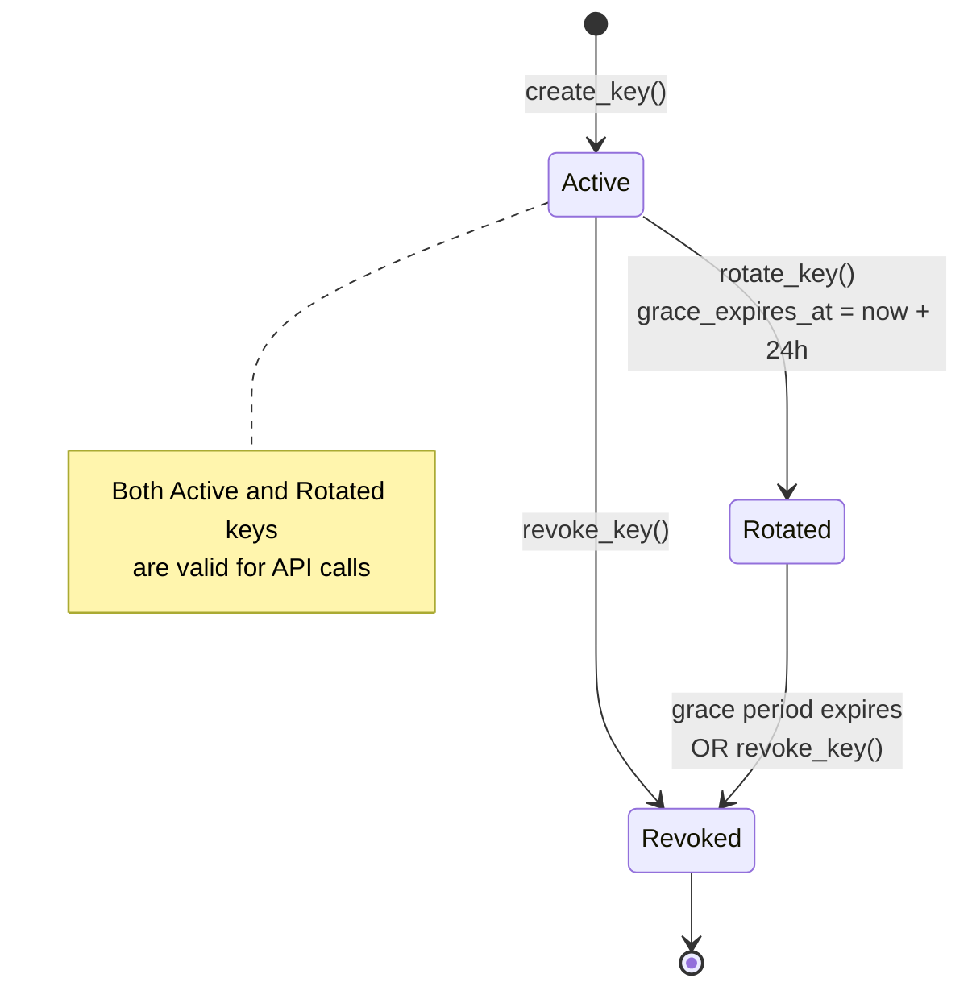
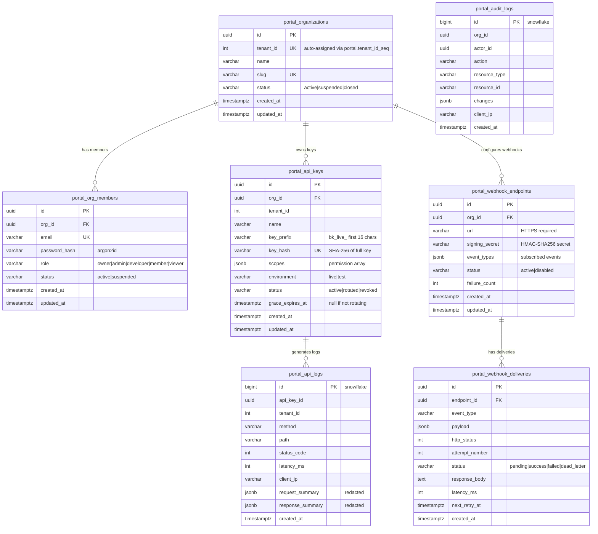
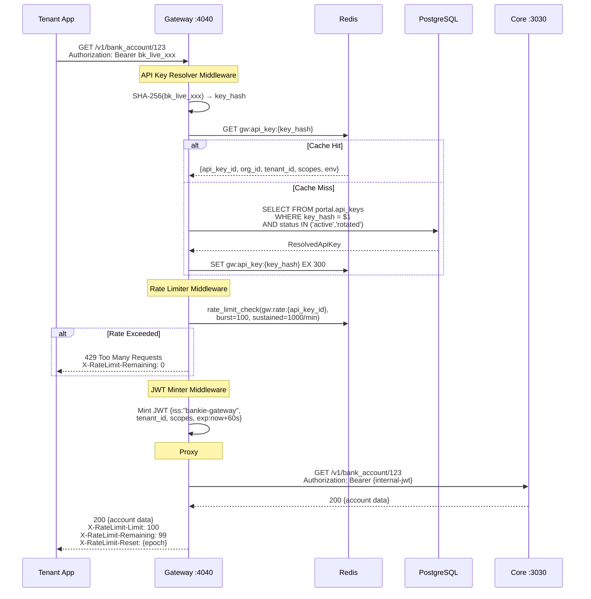
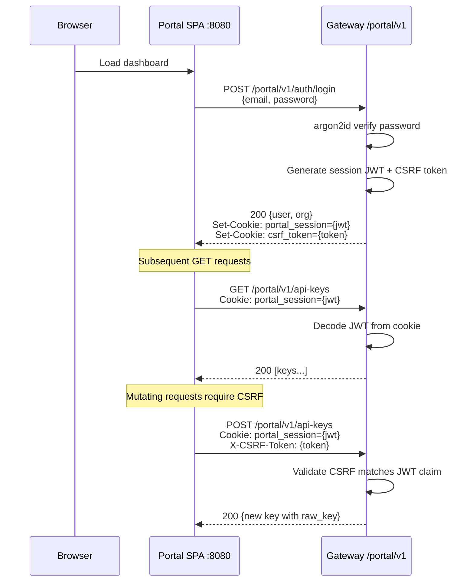

# Tech Spec: Bankie Developer Portal

| Field | Value |
|-------|-------|
| **Owner Pillar** | Fiat / Onboarding |
| **Feature Label** | Developer Portal |
| **Authors** | sam.wang (SVP Eng), Architect Agent |
| **Audiences** | Engineering, Product, Security, Compliance |
| **Status** | Draft |
| **Version** | 1.0 |
| **Reviewers** | chad.liu, sims.xu, ivan.kp.lau, jason.kc.wong |
| **Useful Links** | PRD: `.claude/tasks/dev-portal-prd/pm.md` · Architecture: `.claude/tasks/dev-portal-prd/architect.md` |
| **Approved Date** | — |

---

## 1. TL;DR Change Summary

The Bankie Developer Portal introduces a **self-service API Gateway** (`bankie-gateway`) and **React SPA dashboard** (`portal-spa`) that wrap Bankie Core without modifying existing code. Tenants authenticate via API keys (`bk_live_*`) instead of manually provisioned JWTs. The Gateway resolves keys, enforces scoped permissions, applies rate limiting, mints short-lived internal JWTs, and reverse-proxies requests to Core. Portal members manage organizations, API keys, and view banking data through a session-authenticated dashboard with CSRF protection.

**Impact**: 90% reduction in tenant onboarding time. Zero manual JWT provisioning. Scoped API access with key rotation and grace periods.

---

## 2. Background

### 2.1 Objective

Bankie Core is a production-grade CQRS/Event Sourcing banking system, but tenant onboarding requires manual CLI-based JWT generation (`cargo run --bin bankie -- --mode jwt`). There is no self-service key management, no scoped permissions, no rate limiting, and no team collaboration. The Developer Portal solves these gaps following the industry pattern established by Stripe, Column, Increase, and Modern Treasury.

### 2.2 Goals

| Priority | Goal |
|----------|------|
| P0 | Self-service org signup → API key generation in < 5 minutes |
| P0 | Secure API key lifecycle: create, rotate (with grace period), revoke, scope enforcement |
| P0 | API Gateway with rate limiting (100 req/s burst, 1000/min sustained) |
| P0 | Session-based portal auth with CSRF protection |
| P1 | Data proxy for portal SPA to read Core banking data (accounts, transactions, reports) |
| P1 | Dashboard with key statistics and org management |
| P2 | Webhook delivery with HMAC-SHA256 signing (schema defined, not yet implemented) |
| P2 | API request logging with PII redaction (schema defined, not yet implemented) |

### 2.3 Non-Goals

- Replacing the CQRS/Event Sourcing core architecture
- Mobile app for the portal
- Multi-region deployment (v1 is single-region)
- Custom branding / white-label portal per tenant
- Billing / usage-based pricing
- GraphQL API
- OAuth2 / OIDC for portal login (password-based auth for v1)

---

## 3. Architecture Overview

### 3.1 System Architecture

```mermaid
graph TB
    subgraph "External"
        DEV[Developer / Integration]
        BROWSER[Browser / Dashboard]
    end

    subgraph "Developer Portal Layer"
        subgraph "Portal SPA :8080"
            REACT[React + Vite + TypeScript<br/>TailwindCSS + React Router<br/>React Query]
        end

        subgraph "bankie-gateway :4040"
            subgraph "Portal API /portal/v1/*"
                AUTH_R[Auth Routes<br/>signup / login / logout]
                ORG_R[Org CRUD]
                KEY_R[API Key CRUD<br/>create / list / rotate / revoke]
                DASH_R[Dashboard Stats]
                DATA_R[Data Proxy<br/>accounts / transactions / reports]
            end

            subgraph "Gateway Middleware /v1/*"
                AKR[API Key Resolver<br/>SHA-256 + Redis cache 5min]
                RL[Rate Limiter<br/>Redis token bucket]
                MINT[JWT Minter<br/>60s internal JWT]
                PROXY[Reverse Proxy<br/>hyper-util]
            end

            subgraph "Portal Auth"
                SESSION[Session Middleware<br/>Cookie JWT + CSRF]
                SCOPE[Scope Enforcer<br/>route → scope mapping]
            end
        end
    end

    subgraph "Bankie Core :3030 — UNCHANGED"
        CORE_AUTH[JWT Auth Middleware]
        ROUTES[/v1/* Route Handlers]
        CMD[Command Channel mpsc 10k]
        CQRS[CQRS/ES Aggregates]
    end

    subgraph "Infrastructure"
        PG[(PostgreSQL 16<br/>public + portal schemas)]
        RD[(Redis<br/>cache + rate limit)]
    end

    DEV -->|"Bearer bk_live_xxx"| AKR
    BROWSER -->|HTTPS| REACT
    REACT -->|"Cookie + CSRF"| AUTH_R & ORG_R & KEY_R & DASH_R & DATA_R

    AKR --> RL --> MINT --> PROXY
    PROXY -->|"Bearer internal-jwt"| CORE_AUTH
    CORE_AUTH --> ROUTES --> CMD --> CQRS

    DATA_R -->|"minted JWT"| CORE_AUTH

    ORG_R & KEY_R --> PG
    AKR --> RD
    RL --> RD
```

### 3.2 Cargo Workspace Structure

```
bankie/
├── Cargo.toml                    # [workspace] members, shared deps
├── crates/
│   ├── bankie-core/              # Existing CQRS/ES banking system (UNCHANGED)
│   │   └── src/ (42 .rs files)
│   ├── bankie-gateway/           # NEW: API Gateway + Portal Management API
│   │   └── src/
│   │       ├── main.rs           # Gateway binary — Axum server on :4040
│   │       ├── config.rs         # GatewaySettings (lazy_static, config crate)
│   │       ├── state.rs          # PortalState (trait-object repos + jwt_secret)
│   │       ├── proxy.rs          # Reverse proxy to Core via hyper-util
│   │       ├── redis_ops.rs      # Redis helpers (get, set_ex, rate_limit_check)
│   │       ├── middleware/
│   │       │   ├── api_key_resolver.rs  # SHA-256 lookup + Redis cache
│   │       │   ├── rate_limiter.rs      # Token bucket + X-RateLimit-* headers
│   │       │   ├── jwt_minter.rs        # 60s internal JWT for Core
│   │       │   ├── scope_enforcer.rs    # Route → scope mapping + enforcement
│   │       │   └── session.rs           # Cookie JWT + CSRF validation
│   │       ├── routes/
│   │       │   ├── auth.rs       # signup / login / logout
│   │       │   ├── org.rs        # org CRUD
│   │       │   ├── api_key.rs    # key create / list / rotate / revoke
│   │       │   ├── dashboard.rs  # stats endpoint
│   │       │   └── data_proxy.rs # proxy Core read endpoints for SPA
│   │       ├── models/           # Domain models (auth, org, member, api_key)
│   │       └── repo/             # Repository traits + PgPool impls + mocks
│   └── bankie-common/            # Shared types
│       └── src/
│           ├── lib.rs
│           └── error.rs          # AppError enum (400-500 HTTP errors)
├── portal-spa/                   # NEW: React SPA dashboard
│   └── src/
│       ├── App.tsx               # Routes: Dashboard, ApiKeys, Org, Accounts, etc.
│       ├── hooks/useAuth.ts      # Auth context + session management
│       ├── api/client.ts         # Fetch wrapper with cookie auth
│       ├── pages/ (8 pages)
│       └── components/ (6 components)
├── db/migrations/
│   ├── 20260226000001_portal_schema.sql       # Portal schema + 7 tables
│   └── 20260226000002_portal_tenant_sync.sql  # Trigger: org → tenant sync
└── docker-compose.yml            # 5 services: postgres, redis, migrations, bankie, gateway, portal-spa
```

### 3.3 Service Relationships

| Service | Port | Role | Dependencies |
|---------|------|------|-------------|
| `bankie` (Core) | `:3030` | CQRS/ES banking API | PostgreSQL, Redis |
| `bankie-gateway` | `:4040` | API Gateway + Portal API | PostgreSQL, Redis, Core |
| `portal-spa` | `:8080` | Static SPA (nginx) | Gateway |
| PostgreSQL | `:5432` | Event store, views, portal schema | — |
| Redis | `:6379` | Cache, rate limits, locks | — |

### 3.4 Zero-Modification Contract with Core

The Gateway connects to Core exclusively through **existing interfaces**:

| Integration Point | Mechanism | Core Change Required |
|---|---|---|
| Authentication | Gateway mints JWTs using same `JWT_SECRET` env var | None |
| API proxying | HTTP reverse proxy to `http://bankie-core:3030/v1/*` | None |
| Tenant creation | DB trigger syncs `portal.organizations` → `public.tenants` | None |
| Database | Shared PostgreSQL, Gateway uses `portal` schema | None |
| Redis | Shared Redis, Gateway uses `gw:` key prefix | None |

---

## 4. Domain Design

### 4.1 Use Cases

| Actor | Use Case | Flow |
|-------|----------|------|
| **New Tenant** | Self-service signup | POST `/portal/v1/auth/signup` → creates org + owner member + tenant (via DB trigger) |
| **Portal Member** | Login | POST `/portal/v1/auth/login` → argon2id verify → session JWT cookie + CSRF token |
| **Admin** | Create API key | POST `/portal/v1/orgs/:org_id/keys` → generates `bk_live_*` key, returns raw once |
| **Admin** | Rotate key | POST `/portal/v1/orgs/:org_id/keys/:id/rotate` → old key → `rotated` status with 24h grace |
| **Admin** | Revoke key | DELETE `/portal/v1/orgs/:org_id/keys/:id` → immediate revocation |
| **Developer** | API call via key | `Authorization: Bearer bk_live_xxx` → Gateway resolves → rate limit → mint JWT → proxy to Core |
| **Portal User** | View accounts | SPA → `/portal/v1/data/accounts` → data proxy mints JWT → forward GET to Core |

### 4.2 API Key Lifecycle State Machine



### 4.3 Organization Member Roles

| Role | Org Management | Key Management | View Data | View Logs |
|------|---------------|----------------|-----------|-----------|
| **Owner** | Full CRUD | Full CRUD | Yes | Yes |
| **Admin** | Update | Full CRUD | Yes | Yes |
| **Developer** | Read | Read, Use | Yes | Yes |
| **Member** | Read | Read | Yes | No |
| **Viewer** | Read | — | Yes | No |

### 4.4 API Key Format

```
Format:  bk_live_<32 random base62 chars>   (total: ~41 chars)
Example: bk_live_a1B2c3D4e5F6g7H8i9J0k1L2m3N4o5P6

Storage: SHA-256(full_key) → portal.api_keys.key_hash
Prefix:  first 16 chars → portal.api_keys.key_prefix (for display)
```

### 4.5 Scope Matrix

| Scope | Grants Access To |
|-------|-----------------|
| `accounts:read` | GET `/v1/bank_account/*`, GET `/v1/accounts`, GET `/v1/user/*` |
| `accounts:write` | POST/PATCH/PUT/DELETE `/v1/bank_account/*` |
| `ledgers:read` | GET `/v1/ledger/*` |
| `transactions:read` | GET `/v1/transaction/*`, GET `/v1/report/*` |
| `house_accounts:read` | GET `/v1/house_account` |
| `house_accounts:write` | POST `/v1/house_account` |

### 4.6 Configuration

| Variable | Source | Default | Description |
|----------|--------|---------|-------------|
| `ENV` | env var | `local` | Config file selector: `config.{ENV}.yaml` |
| `DB_PASSWD` | env var | — | PostgreSQL password |
| `JWT_SECRET` | env var | — | Shared with Core for JWT signing (HS256) |
| `CORE_URL` | env var | `http://localhost:3030` | Upstream Core URL for proxy |
| `GATEWAY_LISTEN_ADDR` | env var | `0.0.0.0:4040` | Gateway bind address |

---

## 5. Data Design

### 5.1 Portal Schema (ER Diagram)

All portal tables live in the `portal` PostgreSQL schema. **No foreign keys across schemas** — `tenant_id INTEGER` is the only link to Core's `public.tenants` table.



### 5.2 Key Indexes

```sql
-- API key lookup (hot path)
CREATE UNIQUE INDEX idx_api_keys_key_hash ON portal.api_keys (key_hash);
CREATE INDEX idx_api_keys_org_id ON portal.api_keys (org_id);
CREATE INDEX idx_api_keys_status ON portal.api_keys (status);

-- Organization lookups
CREATE INDEX idx_organizations_tenant_id ON portal.organizations (tenant_id);
CREATE INDEX idx_organizations_status ON portal.organizations (status);

-- Member lookups
CREATE INDEX idx_org_members_org_id ON portal.org_members (org_id);
CREATE INDEX idx_org_members_email ON portal.org_members (email);

-- Webhook polling
CREATE INDEX idx_webhook_deliveries_status ON portal.webhook_deliveries (status);

-- Log queries (partitioned table)
CREATE INDEX idx_api_logs_tenant_id ON portal.api_logs (tenant_id);
CREATE INDEX idx_api_logs_created_at ON portal.api_logs (created_at);
```

### 5.3 Partitioning Strategy

`portal.api_logs` uses **monthly range partitioning** on `created_at`:

```sql
CREATE TABLE portal.api_logs (...) PARTITION BY RANGE (created_at);

-- Pre-created partitions
CREATE TABLE portal.api_logs_2026_02 PARTITION OF portal.api_logs
    FOR VALUES FROM ('2026-02-01') TO ('2026-03-01');
-- ... additional monthly partitions
```

**Retention**: 90-day TTL. Drop oldest partition monthly.

### 5.4 Tenant Synchronization

A PostgreSQL trigger automatically creates a `public.tenants` row when a `portal.organizations` row is inserted:

```sql
CREATE TRIGGER trg_sync_org_to_tenant
    AFTER INSERT ON portal.organizations
    FOR EACH ROW
    EXECUTE FUNCTION portal.sync_org_to_tenant();
```

The trigger inserts into `public.tenants` with full default scopes and `ON CONFLICT DO UPDATE` for idempotency. The `portal.tenant_id_seq` starts at 100 to avoid collisions with manually created tenants.

### 5.5 Privacy Considerations

| Data | Classification | Handling |
|------|---------------|----------|
| API key raw value | Secret | Shown once at creation, only SHA-256 hash stored |
| Password | PII | Hashed with argon2id (OWASP recommended) |
| Email | PII | Stored in portal.org_members, not logged |
| API request/response bodies | May contain PII | Pre-redacted at write time in api_logs |
| Client IP | PII | Stored for audit/security, 90-day retention |

---

## 6. APIs Design

### 6.1 Portal Management APIs

#### 6.1.1 Authentication (Public — No Session Required)

| Method | Path | Description |
|--------|------|-------------|
| POST | `/portal/v1/auth/signup` | Create org + owner member |
| POST | `/portal/v1/auth/login` | Verify credentials → session JWT cookie |
| POST | `/portal/v1/auth/logout` | Clear session + CSRF cookies |

**Signup Request/Response:**

```json
// POST /portal/v1/auth/signup
// Request:
{
  "org_name": "Acme Corp",
  "email": "admin@acme.com",
  "password": "securepassword123"
}

// Response: 200 OK
// Set-Cookie: portal_session=<jwt>; Path=/; HttpOnly; SameSite=Lax; Max-Age=86400
// Set-Cookie: csrf_token=<token>; Path=/; SameSite=Lax; Max-Age=86400
{
  "token": "<jwt>",
  "user": {
    "id": "uuid",
    "email": "admin@acme.com",
    "role": "owner",
    "created_at": "2026-02-27T10:00:00Z"
  },
  "organization": {
    "id": "uuid",
    "name": "Acme Corp",
    "slug": "acme-corp",
    "environment": "live",
    "created_at": "2026-02-27T10:00:00Z"
  }
}
```

**Validation rules:**
- `org_name`: non-empty
- `email`: contains `@`, unique across all members
- `password`: minimum 8 characters

#### 6.1.2 Organization Management (Session Required)

| Method | Path | Auth | Description |
|--------|------|------|-------------|
| POST | `/portal/v1/orgs` | Session | Create organization |
| GET | `/portal/v1/orgs/:id` | Session | Get org (own org only) |
| PATCH | `/portal/v1/orgs/:id` | Owner/Admin | Update name/status |

#### 6.1.3 API Key Management (Session Required)

| Method | Path | Auth | Description |
|--------|------|------|-------------|
| POST | `/portal/v1/orgs/:org_id/keys` | Session | Create key (returns raw once) |
| GET | `/portal/v1/orgs/:org_id/keys` | Session | List keys (prefix only, no raw) |
| DELETE | `/portal/v1/orgs/:org_id/keys/:id` | Session + CSRF | Revoke key immediately |
| POST | `/portal/v1/orgs/:org_id/keys/:id/rotate` | Session + CSRF | Rotate with 24h grace |

**Flat route aliases** (org_id inferred from session):
- POST/GET `/portal/v1/api-keys`
- DELETE `/portal/v1/api-keys/:id`
- POST `/portal/v1/api-keys/:id/rotate`

**Create Key Response:**

```json
// POST /portal/v1/orgs/:org_id/keys
// Request:
{
  "name": "Production Key",
  "scopes": ["accounts:read", "accounts:write", "ledgers:read"]
}

// Response: 200 OK (raw_key shown ONCE)
{
  "id": "uuid",
  "name": "Production Key",
  "key_prefix": "bk_live_a1B2c3D4",
  "raw_key": "bk_live_a1B2c3D4e5F6g7H8i9J0k1L2m3N4o5P6",
  "scopes": ["accounts:read", "accounts:write", "ledgers:read"],
  "created_at": "2026-02-27T10:00:00Z"
}
```

**Rotate Key Response:**

```json
// POST /portal/v1/orgs/:org_id/keys/:id/rotate
// Response: 200 OK
{
  "new_key": {
    "id": "uuid",
    "name": "Production Key (rotated)",
    "key_prefix": "bk_live_x7Y8z9...",
    "raw_key": "bk_live_x7Y8z9...",
    "scopes": ["accounts:read", "accounts:write", "ledgers:read"],
    "created_at": "2026-02-27T10:01:00Z"
  },
  "old_key_id": "uuid",
  "grace_expires_at": "2026-02-28T10:01:00Z"
}
```

#### 6.1.4 Dashboard (Session Required)

| Method | Path | Auth | Description |
|--------|------|------|-------------|
| GET | `/portal/v1/dashboard/stats` | Session | Org stats |

#### 6.1.5 Data Proxy (Session Required)

These routes proxy GET requests to Core using a portal-minted JWT:

| Method | Path | Proxies To |
|--------|------|-----------|
| GET | `/portal/v1/data/accounts` | `/v1/accounts` |
| GET | `/portal/v1/data/accounts/:id` | `/v1/bank_account/:id` |
| GET | `/portal/v1/data/accounts/:id/sub-accounts` | `/v1/bank_account/:id/sub-accounts` |
| GET | `/portal/v1/data/accounts/:id/balance-history` | `/v1/bank_account/:id/balance-history` |
| GET | `/portal/v1/data/transactions` | `/v1/transaction` |
| GET | `/portal/v1/data/ledger/:id` | `/v1/ledger/:id` |
| GET | `/portal/v1/data/reports/settlement` | `/v1/report/settlement` |

### 6.2 Gateway API Key Authentication Flow



### 6.3 Portal Session Authentication Flow



### 6.4 Error Response Format

All errors follow `bankie-common::AppError`:

```json
{
  "code": 400,
  "message": "At least one scope is required"
}
```

| HTTP Status | Error Type | Example |
|-------------|-----------|---------|
| 400 | BadRequest | Invalid input, empty name |
| 401 | Unauthorized | Missing/invalid auth, wrong password |
| 403 | Forbidden | Missing scope, wrong org, CSRF mismatch |
| 404 | NotFound | Key/org not found |
| 409 | Conflict | Duplicate email, already revoked key |
| 429 | TooManyRequests | Rate limit exceeded |
| 500 | InternalServerError | DB error, JWT signing failure |
| 502 | BadGateway | Core unreachable during proxy |

---

## 7. Logging Design

### 7.1 Structured Logging

The Gateway uses `tracing` with structured fields:

| Log Level | Context | Fields |
|-----------|---------|--------|
| `info` | Proxy request | `method`, `upstream_url` |
| `info` | Data proxy | `upstream_url`, `tenant_id` |
| `warn` | Auth failure | Missing/invalid auth header |
| `warn` | Rate limit exceeded | `api_key_id` |
| `warn` | Redis cache miss/error | Cache key, error message |
| `error` | DB error | Query context, error message |
| `error` | Proxy failure | Upstream URL, error message |

### 7.2 PII Redaction

- API request/response bodies in `portal.api_logs` use pre-redacted `request_summary`/`response_summary` JSONB fields
- Account numbers, amounts, and PII are masked before storage
- Client IPs retained for security (90-day TTL via partition drop)

---

## 8. Security Design

### 8.1 Authentication Mechanisms

| Layer | Mechanism | Details |
|-------|-----------|---------|
| **API Key Auth** (tenant → Gateway) | Bearer token `bk_live_*` | SHA-256 hash lookup, Redis cache 5min |
| **Portal Session Auth** (browser → Gateway) | JWT in HttpOnly cookie | 24h expiry, SameSite=Lax |
| **CSRF Protection** | Token in X-CSRF-Token header | Validated against JWT `csrf` claim on POST/PATCH/PUT/DELETE |
| **Internal JWT** (Gateway → Core) | Short-lived JWT | 60s expiry, `iss: "bankie-gateway"` |

### 8.2 Password Security

- **Algorithm**: argon2id (OWASP current recommendation, GPU-resistant)
- **Salt**: Cryptographically random per-password via `OsRng`
- **Minimum length**: 8 characters

### 8.3 API Key Security

| Concern | Mitigation |
|---------|-----------|
| Key leakage | Raw key shown once at creation; only SHA-256 hash stored |
| Key compromise | Rotation with 24h grace period; immediate revoke available |
| Scope escalation | Scopes stored per-key; scope enforcer validates per-route |
| Brute force | Rate limiting on all API calls; fail-open on Redis error |
| Key enumeration | Prefix is non-secret metadata; hash is the authenticator |

### 8.4 CSRF Prevention

- CSRF token embedded in session JWT `csrf` claim
- Set as non-HttpOnly cookie `csrf_token` (readable by JS)
- Required in `X-CSRF-Token` header for all mutating requests
- Compared against JWT claim server-side

### 8.5 Redis Key Namespacing (No Collisions)

| Component | Key Pattern | TTL |
|-----------|------------|-----|
| Core | `outbox_lock` | 600s |
| Core | `balance_snapshot_lock` | 600s |
| Core | `idempotency:{tenant_id}:{key}` | 86400s |
| **Gateway** | `gw:api_key:{hash}` | 300s |
| **Gateway** | `gw:rate:{api_key_id}` | per-window |

### 8.6 Internal JWT Security

- Same `JWT_SECRET` as Core (HS256 symmetric)
- 60s TTL prevents replay
- `iss: "bankie-gateway"` distinguishes from direct tenant JWTs
- `aud: "service"` matches Core's validation
- Claims struct matches Core's `Claims` format

---

## 9. Compatibility Design

### 9.1 Backward Compatibility

| Aspect | Status |
|--------|--------|
| Existing Core API contracts | **No changes** — all `/v1/*` endpoints unchanged |
| Existing JWT authentication | **Still works** — Core accepts both direct JWTs and Gateway-minted JWTs |
| Existing tenant data | **Preserved** — portal uses separate `portal` schema |
| Existing Redis keys | **No collision** — Gateway uses `gw:` prefix |

### 9.2 Migration Path

| Phase | Auth Model | Who |
|-------|-----------|-----|
| Current | Direct JWT → Core `:3030` | Existing tenants |
| Post-Portal | API Key → Gateway `:4040` → Internal JWT → Core | New tenants |
| Transition | Both paths active simultaneously | All tenants |
| Future | API Key only (JWT deprecated) | All tenants |

### 9.3 Supported Platforms

| Component | Requirements |
|-----------|-------------|
| Portal SPA | Modern browsers (Chrome 90+, Firefox 88+, Safari 14+, Edge 90+) |
| Gateway API | Any HTTP client supporting Bearer auth |
| Docker | Docker Engine 24+, Docker Compose v2 |

---

## 10. Operations

### 10.1 Docker Compose Stack

```yaml
# 5 services in docker-compose.yml
services:
  postgresql:    # Port 5432 — shared between Core and Gateway
  redis:         # Port 6379 — shared between Core and Gateway
  migrations:    # Runs DB migrations (including portal schema)
  bankie:        # Port 3030 — Core binary
  bankie-gateway: # Port 4040 — Gateway binary
  portal-spa:    # Port 8080 — nginx serving React SPA
```

### 10.2 Capacity Planning

| Metric | Target | Mechanism |
|--------|--------|-----------|
| Gateway throughput | 10,000 req/s per instance | Axum async, Tokio runtime |
| API key resolution (cache hit) | < 1ms p99 | Redis GET |
| API key resolution (cache miss) | < 10ms p99 | PostgreSQL indexed lookup |
| Rate limit check | < 1ms p99 | Redis Lua script (atomic) |
| Gateway PgPool | max_connections=10 | Sized for portal queries only |
| Rate limit defaults | 100 req/s burst, 1000/min sustained | Per API key |

### 10.3 Monitoring

| Metric | Source | Alert Threshold |
|--------|--------|----------------|
| Gateway request latency | tracing spans | p99 > 50ms |
| Rate limit violations | `gw:rate:*` Redis keys | > 100/min per key |
| API key cache hit rate | Redis GET success rate | < 80% |
| Proxy error rate (502s) | Gateway logs | > 1% |
| Login failure rate | Auth handler logs | > 10/min per IP |
| DB connection pool usage | PgPool metrics | > 80% capacity |

### 10.4 Rollout Plan

1. **Phase 1 (Current)**: Gateway core + Portal API + SPA — API key lifecycle, org management, data proxy
2. **Phase 2**: RBAC enforcement, sandbox environment (`bk_test_*` keys), member management
3. **Phase 3**: Webhook delivery (schema already defined), API request logging, audit trail
4. **Phase 4**: Production hardening — load testing, security review, E2E test suite

### 10.5 Fallback Plan

| Scenario | Fallback |
|----------|----------|
| Gateway down | Tenants fall back to direct JWT auth against Core `:3030` |
| Redis down | Rate limiter fails open (allows request); API key resolution falls through to DB |
| Portal SPA down | API key auth still works; management via direct API calls |
| Core unreachable | Gateway returns 502; SPA data proxy shows error state |

### 10.6 Testing

| Test Type | Count | Scope |
|-----------|-------|-------|
| Unit tests (Core) | 126 | Aggregates, commands, views, report |
| Unit tests (Gateway) | 70+ | Middleware, routes, auth, models, repo |
| E2E tests (Core) | 59 | Full banking lifecycle |
| E2E tests (Portal) | Planned | Signup → create key → API call → data proxy |

**Testing patterns:**
- Repository traits with `mockall::automock` for unit testing
- `tower::ServiceExt::oneshot` for route handler testing
- Session JWT fixtures for auth middleware tests
- Scope enforcement tested with mock repositories

### 10.7 Infrastructure Requirements

| Resource | Current | After Portal |
|----------|---------|-------------|
| PostgreSQL | 1 instance | Same instance, `portal` schema added |
| Redis | 1 instance | Same instance, `gw:*` keys added |
| Docker services | 4 (postgres, redis, migrations, bankie) | 6 (+gateway, +portal-spa) |
| Ports exposed | `:3030`, `:5432`, `:6379` | +`:4040`, +`:8080` |

---

## Appendix A: Valid Scopes

```rust
const VALID_SCOPES: &[&str] = &[
    "accounts:read",
    "accounts:write",
    "ledgers:read",
    "ledgers:write",
    "transactions:read",
    "transactions:write",
    "house_accounts:read",
    "house_accounts:write",
    "reports:read",
];
```

## Appendix B: Competitive Reference

| Feature | Stripe | Column | **Bankie** |
|---------|--------|--------|-----------|
| Key prefix | `sk_live_` / `sk_test_` | `col_` | `bk_live_` / `bk_test_` |
| Key hashing | SHA-256 | SHA-256 | SHA-256 |
| Key rotation | Grace period | Grace period | 24h grace period |
| Rate limiting | Per-key | Per-key | Per-key (100 burst, 1000/min) |
| Portal auth | Password + 2FA | SSO | Password (argon2id) |
| RBAC | Owner/Admin/Dev/Viewer | Admin/Dev | Owner/Admin/Dev/Member/Viewer |
| Webhook signing | HMAC-SHA256 | HMAC-SHA256 | HMAC-SHA256 (planned) |

## Appendix C: Future Work (Not in Scope)

| Item | Phase | Description |
|------|-------|-------------|
| Webhook dispatcher | Phase 3 | Outbox poll → HMAC delivery → retry with backoff |
| API request logging | Phase 3 | Async buffer → batch insert into partitioned api_logs |
| Audit logging | Phase 4 | Append-only tracking of all admin actions |
| Sandbox environment | Phase 2 | `bk_test_*` keys → isolated test tenant |
| Member CRUD | Phase 2 | Invite, role management, status management |
| OAuth2/OIDC | Future | Google/GitHub SSO for portal login |
| IP allowlisting | Future | Restrict API key usage to specific CIDRs |
| Usage analytics | Future | API call trends, error rate charts |
