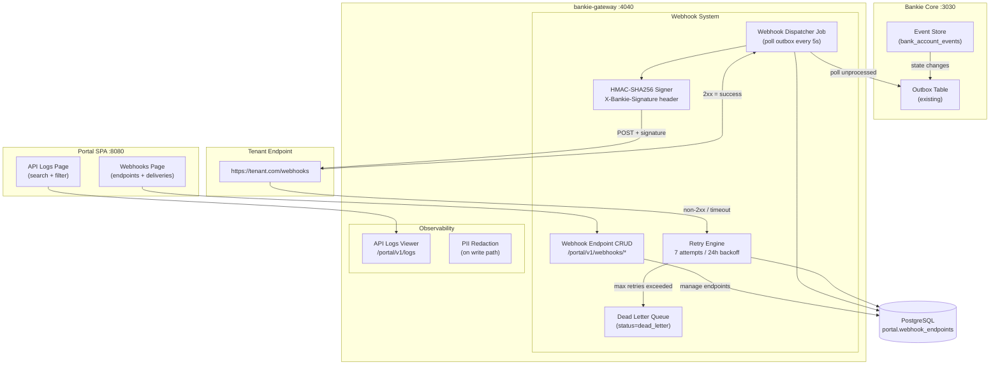

# Phase 3 PRD: Webhooks & Observability (v1.0)

| Field | Value |
|-------|-------|
| **Owner Pillar** | Fiat / Onboarding |
| **Feature Label** | Developer Portal — Phase 3 |
| **Authors** | PM Agent (bankie team) |
| **Audiences** | Engineering, Product, Security |
| **Status** | Draft |
| **Version** | 1.0 |
| **Reviewers** | sam.wang (SVP Eng), chad.liu, sims.xu, ivan.kp.lau |
| **PRD Date** | 2026-03-02 |
| **Depends On** | Phase 2 (RBAC, rate limiter, grace expiry) — Complete |

---

## 1. Executive Summary

Phase 3 adds **webhook event delivery** and **API observability** to the Bankie Developer Portal. Tenants will be able to register HTTPS endpoints, subscribe to banking events (account state changes, transaction completions), and receive HMAC-signed payloads with retry guarantees. On the observability side, the portal will surface a searchable API request log viewer and add PII redaction to logged payloads.

**Build vs. Buy recommendation**: Build in-house. Detailed analysis in Section 5.

**Estimated effort**: ~30h across 9 work items, achievable with 2 devs in ~4 working days.

---

## 2. Problem Statement

| # | Problem | Impact | Severity |
|---|---------|--------|----------|
| P3 | No webhook system — tenants must poll Core for state changes | Inefficient integration, missed events, delayed reconciliation, higher API load from polling | **High** |
| P6a | API request logs exist but have no viewer in SPA | Ops teams cannot search or filter request history without DB access | **Medium** |
| P6b | API logs contain unredacted PII (client IPs, potentially sensitive path params) | Compliance risk, data minimization violation | **Medium** |
| P6c | No webhook delivery visibility — tenants cannot debug failed deliveries | Increased support burden, slower integration debugging | **Medium** |

### What Success Looks Like

A tenant registers a webhook endpoint in the portal, subscribes to `account.approved` and `transaction.completed` events, and receives signed payloads within 5 seconds of state changes. Failed deliveries are retried with exponential backoff. The tenant can inspect delivery history (status, latency, response codes) directly in the SPA.

---

## 3. Architecture Overview



### Key Design Decisions

| Decision | Rationale |
|----------|-----------|
| **Poll-based dispatcher** (not trigger/CDC) | Core's outbox table already exists with retry semantics. Adding a webhook-aware poll job in Gateway is the simplest path — no Core code changes needed. |
| **Gateway-side delivery** (not Core-side) | Webhook config lives in `portal` schema. Gateway already has org/tenant context. Core stays unchanged. |
| **Per-event-type subscription** | Standard pattern (Stripe, Column). Tenants subscribe to specific event types, not all-or-nothing. |
| **HMAC-SHA256 signing** | Industry standard. Same approach as Stripe, Column, Modern Treasury. Includes timestamp to prevent replay. |
| **Exponential backoff with jitter** | Prevents thundering herd. 7 attempts over ~24h matches Stripe's retry schedule. |
| **Dead letter after max retries** | No infinite retry. Events move to `dead_letter` status for manual inspection and replay. |

---

## 4. Requirements (MoSCoW)

### MUST Have (P0)

| ID | Requirement | Acceptance Criteria | Effort |
|----|------------|---------------------|--------|
| M1 | **Webhook endpoint CRUD** | Create/list/update/delete endpoints via `/portal/v1/webhooks`. Each endpoint has URL (HTTPS enforced), event types subscription, auto-generated signing secret. RBAC: Owner/Admin only for create/delete; Member can list. | 4h |
| M2 | **Webhook dispatcher job** | Background job polls Core's outbox (or a new `webhook_outbox` view) every 5s. Matches completed events against registered endpoints by event type. Creates delivery records in `portal.webhook_deliveries`. Redis distributed lock to prevent duplicate processing. | 6h |
| M3 | **HMAC-SHA256 payload signing** | Every delivery includes `X-Bankie-Signature` header: `t=<unix_ts>,v1=<hmac_sha256(timestamp.payload, signing_secret)>`. Tenants verify signature + reject if timestamp drift > 5 minutes. Documented verification example in API docs. | 2h |
| M4 | **Retry with exponential backoff** | Failed deliveries (non-2xx or timeout > 30s) retry up to 7 times. Schedule: 30s, 2m, 15m, 1h, 4h, 12h, 24h. After 7 failures → `dead_letter`. Endpoint auto-disabled after 5 consecutive failures across any delivery. | 4h |
| M5 | **Webhook delivery logs API** | `GET /portal/v1/webhooks/:endpoint_id/deliveries` — paginated list of delivery attempts with status, http_status, latency_ms, attempt_number, created_at. Filterable by status (pending/success/failed/dead_letter). | 2h |

### SHOULD Have (P1)

| ID | Requirement | Acceptance Criteria | Effort |
|----|------------|---------------------|--------|
| S1 | **API request log PII redaction** | Redact `client_ip` to `/24` subnet (IPv4) or `/48` (IPv6) on write. Strip sensitive query params (`token`, `secret`, `password`) from `path`. Redact `Authorization` header from `request_summary`. Applied in `api_logger` middleware before DB insert. | 2h |
| S2 | **SPA: Webhooks page** | List endpoints (URL, status, event types, failure count). Create endpoint form (URL, event type checkboxes). Delete/disable toggle. Delivery history table per endpoint (expandable). Copy signing secret (show once on create). | 4h |
| S3 | **SPA: API Logs page** | Searchable/filterable log viewer. Filters: time range, status code, method, path prefix. Paginated table with method, path, status, latency, timestamp. Click to expand request/response summary. | 3h |

### COULD Have (P2)

| ID | Requirement | Acceptance Criteria | Effort |
|----|------------|---------------------|--------|
| C1 | **Manual webhook retry** | `POST /portal/v1/webhooks/:endpoint_id/deliveries/:id/retry` — re-attempts a failed/dead_letter delivery. Creates new attempt record. | 1h |
| C2 | **Webhook test/ping** | `POST /portal/v1/webhooks/:endpoint_id/test` — sends a test event to validate endpoint connectivity. Returns delivery result immediately (sync). | 1h |
| C3 | **Dashboard webhook stats** | Add to existing `/portal/v1/dashboard/stats`: total endpoints, deliveries in last 24h, success rate percentage. | 1h |

### WON'T Have (Phase 3)

| ID | Requirement | Rationale |
|----|------------|-----------|
| W1 | Fan-out to multiple URLs per event type | One endpoint per URL is sufficient for v1. Tenants can register multiple endpoints. |
| W2 | Webhook event filtering by account/amount | Too granular for v1. Tenants filter on their side after receiving events. |
| W3 | ClickHouse migration for api_logs | PostgreSQL partitioned tables are adequate at current scale (<1M rows/month). Re-evaluate at 10M+. |
| W4 | Real-time log streaming (WebSocket) | Polling/pagination is sufficient. SSE/WS adds complexity for marginal benefit at current scale. |

---

## 5. Scope Decision: Svix vs. In-House (Q1)

### Recommendation: **Build In-House**

| Factor | Svix (SaaS) | Svix (Self-hosted) | In-House |
|--------|------------|-------------------|----------|
| **Setup time** | ~2h (API integration) | ~4h (Docker deploy + config) | ~18h (M1-M5) |
| **Monthly cost** | $200-500/mo (Business plan) | $0 (OSS) but ops overhead | $0 |
| **Delivery reliability** | 99.99% SLA | Self-managed | Self-managed |
| **Customization** | Limited (their event schema) | Full (Rust SDK available) | Full (native Rust) |
| **DB schema** | Must adapt to Svix schema | Separate Svix DB | Use existing `portal.webhook_*` tables (already created) |
| **Dependency risk** | Vendor lock-in, SaaS dependency | Additional Docker service, separate DB | Zero new dependencies |
| **Latency** | +50-100ms (external API call) | +5-10ms (local service) | <1ms (same process) |
| **Secret management** | Svix manages signing keys | Svix manages signing keys | We control signing secrets |

### Rationale

1. **Tables already exist** — `portal.webhook_endpoints` and `portal.webhook_deliveries` are created and indexed. Svix would require migration to its own schema or running a parallel data model.

2. **Architectural fit** — The Gateway already has the cron job pattern (grace expiry), Redis distributed locking, and repository traits. Adding a webhook dispatcher follows the identical pattern.

3. **Volume is low** — Bankie targets 1,000 tenants with moderate event throughput. Svix's value proposition (millions of deliveries/day, multi-region fanout) is overkill.

4. **Control** — We own the signing secret lifecycle, payload format, retry schedule, and dead-letter policy. No adapting to Svix's opinionated conventions.

5. **Cost** — Zero incremental cost. Svix SaaS at $200+/mo is unjustified for the event volume.

**Risk of in-house**: If event volume exceeds 100K deliveries/day, consider Svix self-hosted. Current architecture supports ~50K/day comfortably (5s poll interval × 12 events/poll × 86,400s/day ÷ 5).

---

## 6. Scope Decision: API Logs Storage (Q3)

### Recommendation: **Stay on PostgreSQL** (partitioned)

Current state: `portal.api_logs` is range-partitioned by month (Feb-Apr 2026 partitions exist). At current scale (<100K rows/month), PostgreSQL handles reads comfortably with the existing indexes on `tenant_id`, `api_key_id`, and `created_at`.

**Migration trigger**: When monthly partition exceeds 10M rows or log viewer queries exceed 500ms p95, evaluate ClickHouse. This is a Phase 5+ concern.

**Partition management**: Add a cron job or migration to create monthly partitions 3 months ahead (automated partition creation is a S-tier backlog item).

---

## 7. Event Types (Phase 3 Scope)

| Event Type | Source | Trigger | Payload Summary |
|------------|--------|---------|-----------------|
| `account.opened` | BankAccount aggregate | `AccountOpened` event | `{account_id, account_type, currency, status, tenant_id}` |
| `account.approved` | BankAccount aggregate | `AccountApproved` event | `{account_id, status: "approved", approved_at}` |
| `account.frozen` | BankAccount aggregate | `AccountFrozen` event | `{account_id, status: "frozen", reason}` |
| `account.closed` | BankAccount aggregate | `AccountClosed` event | `{account_id, status: "closed"}` |
| `transaction.completed` | Outbox → Ledger job | Transaction status → `completed` | `{transaction_id, account_id, type, amount, currency, amount_usd, status}` |
| `transaction.failed` | Outbox dead letter | Max retries exceeded | `{transaction_id, account_id, type, amount, error}` |

### Payload Envelope

```json
{
  "id": "evt_uuid",
  "type": "account.approved",
  "created_at": "2026-03-02T12:00:00Z",
  "tenant_id": 100,
  "data": {
    "account_id": "uuid",
    "status": "approved",
    "approved_at": "2026-03-02T12:00:00Z"
  }
}
```

### PII Considerations

- **No PII in webhook payloads** — payloads contain only IDs, statuses, amounts, and timestamps. No user emails, names, or addresses.
- **tenant_id** is included so tenants can correlate events to their internal systems. This is not PII (it's an opaque integer).
- **Signing secret** is shown once at endpoint creation (same UX as API key raw value).

---

## 8. Risk Assessment

| # | Risk | Probability | Impact | Mitigation | Owner |
|---|------|------------|--------|-----------|-------|
| R1 | **Duplicate webhook deliveries** — dispatcher processes same event twice | Medium | Medium | Redis distributed lock + unique constraint on `(endpoint_id, event_type, event_source_id)` in `webhook_deliveries`. Idempotency guidance in docs. | Dev |
| R2 | **Webhook delivery latency > 5s** — slow endpoint blocks dispatcher | Medium | Low | Async HTTP client with 30s timeout per delivery. Spawn deliveries concurrently (up to 10 in-flight per cycle). Slow endpoints don't block others. | Dev |
| R3 | **Tenant endpoint DDoS via webhook** — high event volume floods tenant | Low | Medium | Rate cap: max 100 deliveries/min per endpoint. Excess queued. Document expected throughput in API docs. | Dev |
| R4 | **Outbox schema coupling** — Core outbox format changes break dispatcher | Low | High | Dispatcher reads outbox as JSON (already `jsonb payload`). Version the event payload format. Add defensive parsing with `serde(default)`. | Architect |
| R5 | **Signing secret leak** — compromised secret allows payload forgery | Low | High | Secret shown once (same pattern as API key). Rotate endpoint = new secret. HMAC includes timestamp for replay protection. | Security |
| R6 | **Dead letter accumulation** — no cleanup policy for failed deliveries | Medium | Low | Retention policy: auto-delete dead_letter records after 30 days. Surface count in dashboard. | Dev |
| R7 | **Partition exhaustion** — api_logs partitions not created ahead of time | Medium | Medium | Add partition creation to monthly cron or migration. Alert if current partition is within 2 weeks of boundary. | Infra |

---

## 9. Timeline & Effort Estimates

### Work Breakdown

| # | Task | Effort | Priority | Dependencies | Dev |
|---|------|--------|----------|-------------|-----|
| T1 | Webhook endpoint CRUD API (routes, repo, models, tests) | 4h | M1 | None | Dev-1 |
| T2 | Webhook dispatcher job (outbox polling, event matching, delivery creation) | 6h | M2 | T1 | Dev-1 |
| T3 | HMAC-SHA256 signing module + verification docs | 2h | M3 | T1 | Dev-2 |
| T4 | Retry engine (exponential backoff, dead letter, endpoint disable) | 4h | M4 | T2 | Dev-1 |
| T5 | Webhook delivery logs API | 2h | M5 | T2 | Dev-2 |
| T6 | API log PII redaction (middleware update) | 2h | S1 | None | Dev-2 |
| T7 | SPA: Webhooks page (endpoints + deliveries) | 4h | S2 | T1, T5 | Dev-2 |
| T8 | SPA: API Logs page (search + filter) | 3h | S3 | T6 | Dev-2 |
| T9 | Unit + integration tests (webhook flow, signing, retry, redaction) | 3h | — | T1-T6 | Both |
| | **Total** | **30h** | | | |

### Recommended Staffing: 2 Devs

| Dev | Tasks | Total | Calendar |
|-----|-------|-------|----------|
| Dev-1 | T1 (4h) → T2 (6h) → T4 (4h) → T9 (1.5h) | ~15.5h | ~2 days |
| Dev-2 | T3 (2h) → T6 (2h) → T5 (2h) → T7 (4h) → T8 (3h) → T9 (1.5h) | ~14.5h | ~2 days |

**Estimated delivery**: 4 working days (including code review and integration testing).

### Milestone Schedule

| Milestone | Target | Exit Criteria |
|-----------|--------|---------------|
| M1: Backend complete | Day 2 | T1-T6 done. Webhook CRUD + dispatcher + signing + retry + PII redaction. All unit tests passing. `SQLX_OFFLINE=true cargo test` green. |
| M2: SPA complete | Day 3 | T7-T8 done. Webhooks page and Logs page functional. Manual testing via `make local-interactive`. |
| M3: Integration test | Day 4 | T9 done. E2E: create endpoint → trigger event → verify signed delivery → check delivery log. Clippy + fmt clean. |
| M4: PR ready | Day 4 | Code review complete. `cargo clippy --all-targets --no-default-features --tests --benches -- -D warnings` passes. PR submitted. |

---

## 10. Success Metrics

| Metric | Baseline | Target (1 month post-launch) |
|--------|----------|------------------------------|
| Webhook delivery success rate (first attempt) | N/A | > 95% |
| Webhook delivery success rate (within 24h retries) | N/A | > 99.5% |
| Webhook delivery latency (p95, first attempt) | N/A | < 5s from event creation |
| Dead letter rate | N/A | < 0.1% of total deliveries |
| API log query latency (p95, SPA viewer) | N/A | < 500ms for 30-day range |
| PII fields redacted in api_logs | 0% | 100% of new writes |
| Webhook endpoint adoption | 0 endpoints | > 30% of active orgs have ≥1 endpoint |
| Unit test count (gateway) | 163 | 190+ (27+ new tests for webhook + PII) |

---

## 11. Dependencies

### Prerequisites (all met)

| Dependency | Status | Notes |
|-----------|--------|-------|
| Phase 2 complete (RBAC, rate limiter, grace expiry) | **Done** (PR #19) | RBAC middleware available for webhook routes. |
| `portal.webhook_endpoints` table | **Exists** | Created in migration `20260226000001_portal_schema.sql`. |
| `portal.webhook_deliveries` table | **Exists** | Created in same migration. Indexed on `endpoint_id`, `status`, `created_at`. |
| Core outbox table | **Exists** | `public.outbox_entries` with `event_type`, `payload` (jsonb). Polled by ledger job every 10s. |
| Redis distributed locking | **Exists** | `redis_ops::set_nx_ex` pattern used by grace expiry job. Reusable for webhook dispatcher. |
| Gateway cron job pattern | **Exists** | `job.rs` grace expiry job — identical pattern for webhook dispatcher. |
| Repository trait + mockall pattern | **Exists** | `MockApiKeyRepository` etc. New `WebhookRepository` follows same pattern. |

### New Infrastructure Required

| Item | Description |
|------|-------------|
| None | All infrastructure (PostgreSQL, Redis, Docker Compose) already provisioned. No new services or ports needed. |

### Schema Changes Required

| Change | Reason |
|--------|--------|
| Add `event_source_id UUID` to `portal.webhook_deliveries` | Track which Core event triggered the delivery. Enables dedup via unique constraint. |
| Add `description VARCHAR` to `portal.webhook_endpoints` | Optional human-readable endpoint description (standard UX). |
| Add `portal.api_logs` partitions for May-Jul 2026 | Preventive partition creation. |

---

## 12. Open Questions Resolved

| # | Question | Decision |
|---|----------|----------|
| Q1 | Svix vs in-house? | **In-house**. Tables exist, volume is low, architectural fit is strong. See Section 5. |
| Q3 | PostgreSQL vs ClickHouse for api_logs? | **PostgreSQL** (partitioned). Re-evaluate at 10M rows/month. See Section 6. |

### New Open Questions

| # | Question | Owner | Status |
|---|----------|-------|--------|
| Q7 | Should webhook dispatcher poll Core outbox directly or maintain a separate `webhook_outbox` view? | Architect | Open — recommend direct poll with `processed_for_webhook` flag to avoid coupling with ledger job. |
| Q8 | Should endpoint auto-disable threshold be configurable per org? | Product | Recommend: fixed at 5 consecutive failures for v1. Configurable in future. |
| Q9 | What event types should be added in Phase 4+? (e.g., `ledger.credited`, `member.invited`) | Product | Backlog — Phase 3 covers account + transaction events only. |

---

## 13. Competitive Alignment

| Feature | Stripe | Column | Increase | Modern Treasury | **Bankie Phase 3** |
|---------|--------|--------|----------|----------------|-------------------|
| Webhook CRUD | Yes | Yes | Yes | Yes | **Yes** |
| HMAC-SHA256 signing | Yes | Yes | Yes | Yes | **Yes** |
| Replay protection (timestamp) | Yes | Yes | — | Yes | **Yes** |
| Retry (exponential backoff) | Yes (8 attempts / 72h) | Yes | Yes | Yes | **Yes** (7 attempts / 24h) |
| Dead letter queue | Yes | Yes | — | — | **Yes** |
| Delivery logs in dashboard | Yes | Yes | Yes | Yes | **Yes** |
| Manual retry | Yes | — | — | — | **Could** (C1) |
| Test/ping endpoint | Yes | Yes | — | — | **Could** (C2) |
| Event filtering (per-type) | Yes | Yes | Yes | Yes | **Yes** |

---

## Appendix A: Retry Schedule

| Attempt | Delay | Cumulative Time |
|---------|-------|----------------|
| 1 (initial) | Immediate | 0 |
| 2 | 30 seconds | 30s |
| 3 | 2 minutes | 2m 30s |
| 4 | 15 minutes | 17m 30s |
| 5 | 1 hour | 1h 17m |
| 6 | 4 hours | 5h 17m |
| 7 | 12 hours | 17h 17m |
| Dead letter | — | ~17h 17m |

Jitter: ±10% on each delay to prevent thundering herd.

## Appendix B: HMAC Signature Verification (Tenant Docs)

```python
import hmac
import hashlib
import time

def verify_webhook(payload: bytes, signature_header: str, secret: str, tolerance_secs: int = 300) -> bool:
    """Verify Bankie webhook signature."""
    parts = dict(p.split("=", 1) for p in signature_header.split(","))
    timestamp = parts["t"]
    expected_sig = parts["v1"]

    # Check timestamp freshness (prevent replay)
    if abs(time.time() - int(timestamp)) > tolerance_secs:
        return False

    # Compute expected signature
    signed_payload = f"{timestamp}.{payload.decode()}"
    computed = hmac.new(
        secret.encode(), signed_payload.encode(), hashlib.sha256
    ).hexdigest()

    return hmac.compare_digest(computed, expected_sig)
```

## Appendix C: Webhook Event Payload Examples

### account.approved

```json
{
  "id": "evt_a1b2c3d4-e5f6-7890-abcd-ef1234567890",
  "type": "account.approved",
  "created_at": "2026-03-02T14:30:00Z",
  "tenant_id": 100,
  "data": {
    "account_id": "550e8400-e29b-41d4-a716-446655440000",
    "status": "approved",
    "account_type": "checking",
    "currency": "USD"
  }
}
```

### transaction.completed

```json
{
  "id": "evt_f1e2d3c4-b5a6-7890-fedc-ba9876543210",
  "type": "transaction.completed",
  "created_at": "2026-03-02T14:31:00Z",
  "tenant_id": 100,
  "data": {
    "transaction_id": "660e8400-e29b-41d4-a716-446655440001",
    "account_id": "550e8400-e29b-41d4-a716-446655440000",
    "type": "deposit",
    "amount": "1000.00",
    "currency": "USD",
    "amount_usd": "1000.00",
    "status": "completed"
  }
}
```
